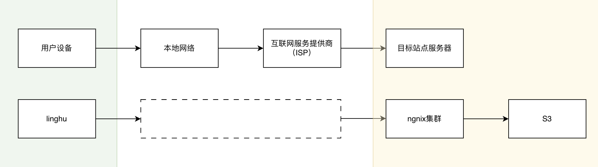
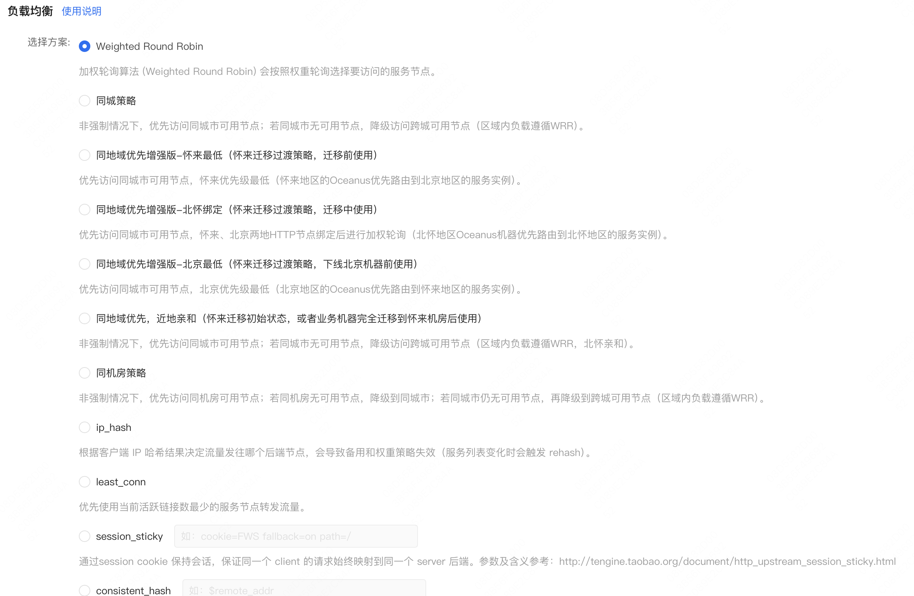
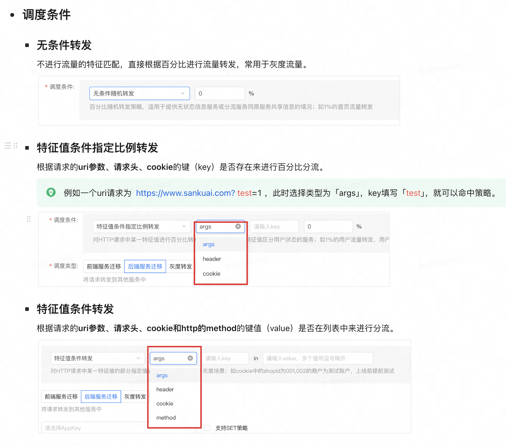
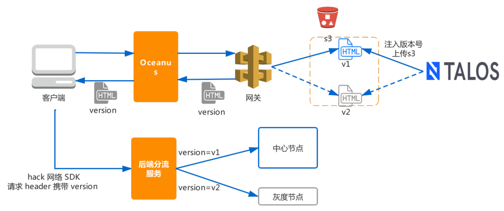

# 前端负载均衡&流量调度

先思考：前端站点怎么配置流量分发？

## 名词解释

| 名词 | 解释 |
| --- | --- |
| 站点 | 承载一份负载均衡配置的最小单位，对应nginx配置中的server块。站点下包含域名、证书、映射规则（关联服务）等资源。通常情况下一个站点可对应多个域名，这些域名共享同一份负载均衡配置；多个服务也可以通过不同的映射规则，在同一个站点通过其域名对外提供服务 |
| 域名 | `站点和域名在Oceanus是两个概念，站点≠域名; Oceanus会在创建线上或外网站点时为用户申请域名，后续域名的管理（DNS解析、内外网）是在Domain系统中。` 一种开放给用户的访问资源，对应nginx配置的server_name部分，在HTTP协议中，是定位资源的重要部分。Oceanus作为七层负载均衡器主要承担了HTTP服务的负载均衡配置，从用户侧来说都是通过域名体现的。|
| 映射规则 |又称为路由规则或者location，是基于nginx原生的location指令提供的一种请求分发方式，其中映射规则的重要属性「路径（path）」，决定一个请求具体会由哪一个映射规则来处理。每一个映射规则只能关联一个服务单元（即appkey），Oceanus的计费单元也会根据映射规则绑定的appkey进行计算 |
| 负载均衡配置 |Oceanus基于nginx提供了负载均衡能力，而Nginx基于静态配置提供服务，Oceanus中的负载均衡配置大多数时候指的就是这份影响负载均衡的静态配置。|
| 流量调度策略 | Oceanus基于Http请求的特征进行分流的功能，可以根据请求的请求头、uri参数等条件进行分流。|

## 访问灵狐流量路径

## 常见流量分发方式

流量发出之后，途径的每一个网络节点，都可以做流量分发。常见的流量分发方式及应用场景如下：

1. `​DNS负载均衡`：DNS解析返回不同的IP地址，实现用户请求的分散。适用于处理初步的地理位置分发和简单的负载均衡。

2. `​CDN（内容分发网络）`：缓存站点内容。用户请求由最近节点响应，实现静态内容的分发、加速网站加载速度。

3. `​反向代理`：将客户端的请求分发到后端的多个服务器

4. `​负载均衡器`：通过负载均衡策略（如轮询、最少连接、IP哈希等）管理大规模的应用流量。
  

5. `​http流量分发`：逻辑计算query、cookie、header等，实现更细粒度的流量控制。

## {海洋}流量调度策略

定义：基于Http请求的特征进行分流的功能，可以根据请求的请求头、uri参数等条件进行分流。
> 了解流量调度策略的生效机制
HTTP请求是按照以下顺序在Oceanus进行的匹配：
HTTP请求 -> 匹配站点域名 -> 匹配映射规则 -> 匹配该映射规则关联的策略
请求需要先匹配到对应映射规则才能再匹配策略，因此，策略需要生效，必须绑定映射规则。

## 流量分流具体应用：灰度

新的发布只让一部分流量可访问，通过流量调度策略，部分返回旧的资源v1，部分返回新的资源v2。客户端发起数据请求时，请求header带上版本，服务端获取到版本，访问对应版本服务响应数据。

