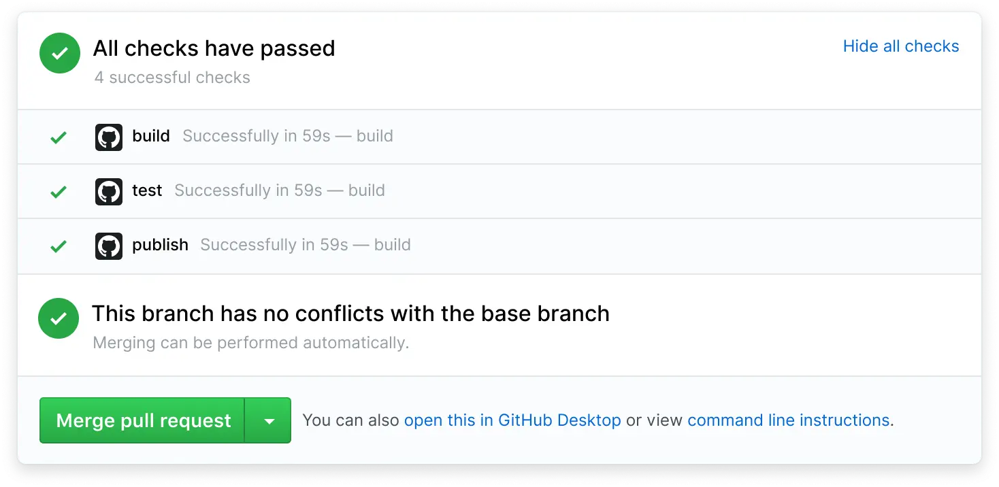
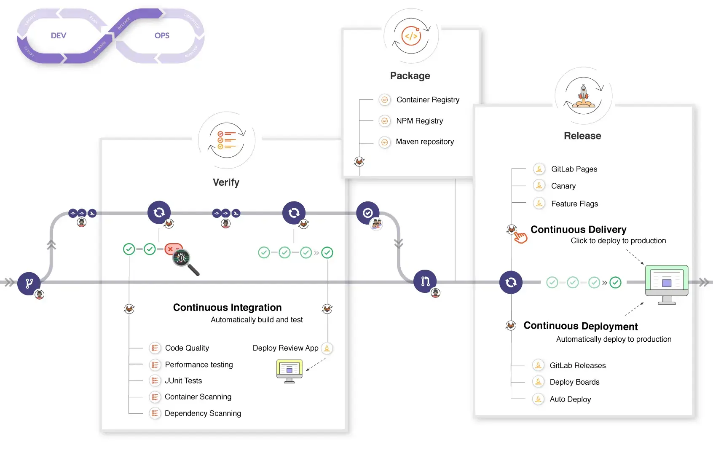
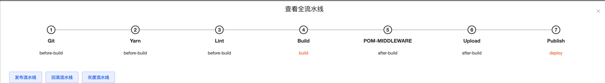
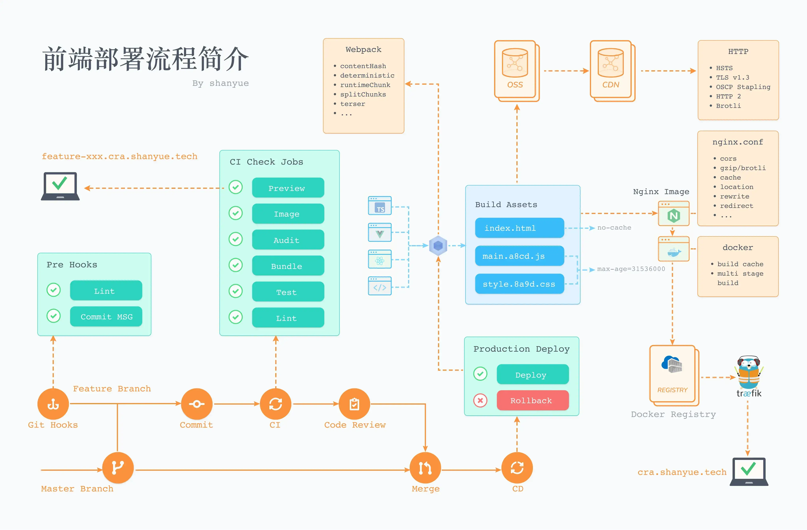
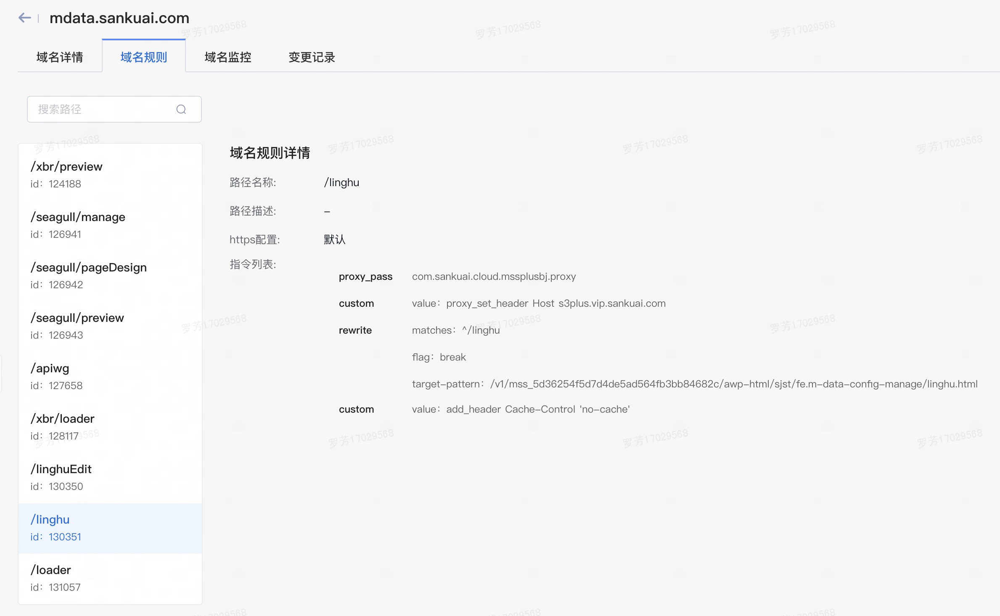
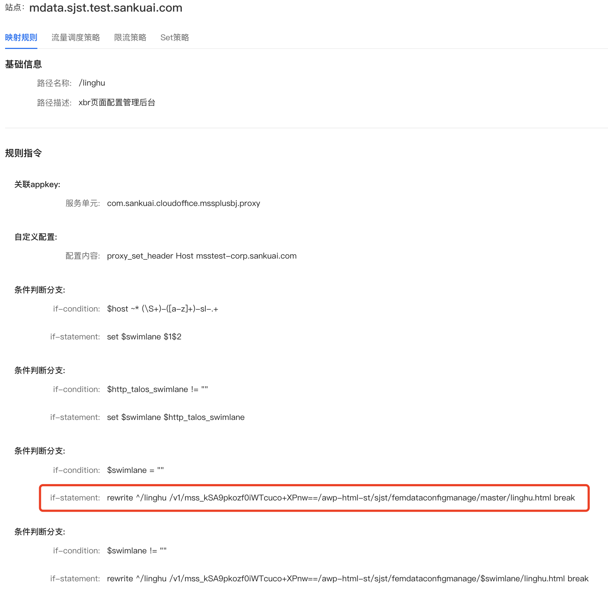
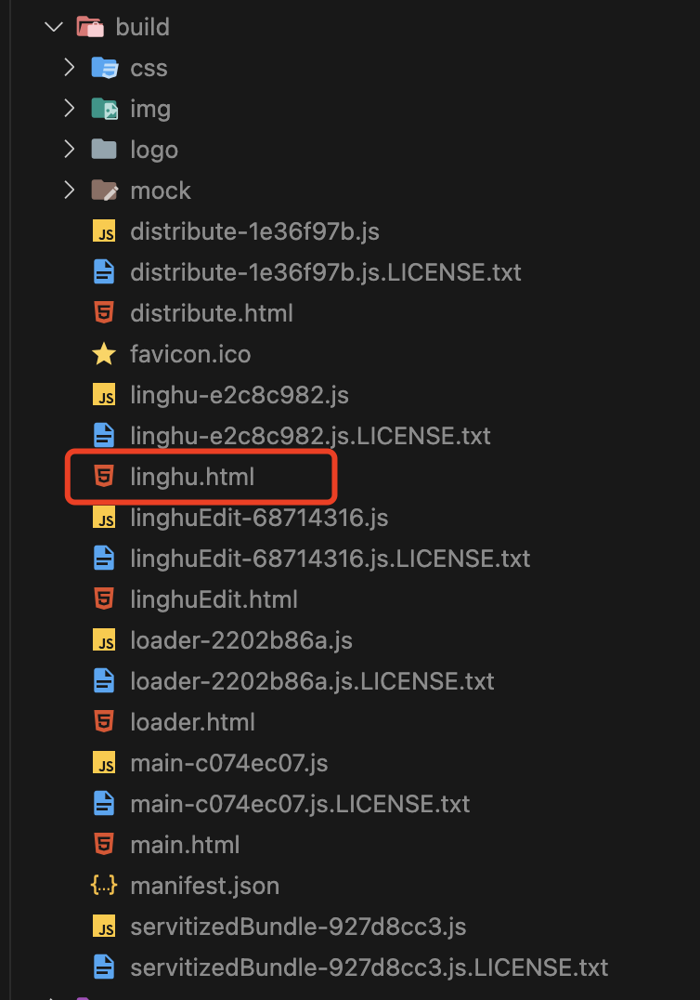

# 前端部署

- [前端部署](#前端部署)
  - [常见的Web服务器](#常见的web服务器)
  - [本地部署演示](#本地部署演示)
  - [前端部署的到底是什么？](#前端部署的到底是什么)
  - [部署的发展历程](#部署的发展历程)
  - [传统部署方式：发邮件运维部署服务器](#传统部署方式发邮件运维部署服务器)
    - [常用的传统部署工具](#常用的传统部署工具)
  - [云服务器部署](#云服务器部署)
  - [自动化部署](#自动化部署)
    - [CI/CD介绍](#cicd介绍)
    - [CICD 工具与产品](#cicd-工具与产品)
      - [github actions CI/CD演示](#github-actions-cicd演示)
      - [talos工具部署流程介绍](#talos工具部署流程介绍)
  - [灵狐的部署](#灵狐的部署)
    - [ngnix常用配置](#ngnix常用配置)
  - [灵狐的构建产物](#灵狐的构建产物)
  - [回滚实现方案](#回滚实现方案)

## 常见的Web服务器

1. Apache HTTP Server：

    - 简介：Apache是最常见和广泛使用的Web服务器之一。它是一个开源的、跨平台的服务器软件，具有稳定性和可靠性，并支持多种操作系统。

    - 使用方式：安装Apache后，可以通过编辑配置文件来配置服务器，如设置监听端口、虚拟主机等。将网站文件放置在指定的目录下，启动Apache服务后，即可通过浏览器访问网站。

2. Nginx：

    - 简介：Nginx是一个高性能的开源Web服务器，也是一个反向代理服务器。它具有轻量级和高并发处理能力，适用于处理静态文件、负载均衡和反向代理等场景。

    - 使用方式：安装Nginx后，通过编辑配置文件来配置服务器，如设置监听端口、虚拟主机、反向代理等。`将网站文件放置在指定的目录下，启动Nginx服务后，即可通过浏览器访问网站`。

3. Microsoft IIS：

    - 简介：Microsoft Internet Information Services（IIS）是微软开发的Web服务器软件，适用于Windows操作系统。它提供了强大的功能和集成性能，广泛用于Microsoft技术栈的应用部署。

    - 使用方式：在Windows服务器上安装IIS后，通过管理工具进行配置，如设置网站、应用程序池、绑定域名等。将网站文件放置在指定的目录下，启动IIS服务后，即可通过浏览器访问网站。

4. Lighttpd：

    - 简介：Lighttpd是一个轻量级的Web服务器，特点是占用资源少、速度快。它适用于低资源环境和高并发请求的场景。

    - 使用方式：安装Lighttpd后，通过编辑配置文件来配置服务器，如设置监听端口、虚拟主机等。将网站文件放置在指定的目录下，启动Lighttpd服务后，即可通过浏览器访问网站。

5. Tomcat：

    - 简介：Apache Tomcat是一个开源的Java Servlet容器，也可以作为Web服务器使用。它主要用于部署和运行Java Web应用程序。

    - 使用方式：安装Tomcat后，将Java Web应用程序打包成WAR文件，将WAR文件放置在Tomcat的指定目录下，启动Tomcat服务后，即可通过浏览器访问应用程序。

## 本地部署演示

```shell
# Apache服务器 web根目录在：/Library/WebServer/Documents

#停止 Apache：
sudo apachectl stop

#重启 Apache：
sudo apachectl restart

# 打开 http://127.0.0.1/
```

## 前端部署的到底是什么？

上面操作部署的是一个静态资源。那一个web项目，前端部署的到底是什么呢？或者说什么时候开始有前端部署？

**`前后端分离之前`**，部署基本与前端不相干。

PHP：将代码和资源文件直接上传到服务器的指定目录中。

Java：需要将Java代码编译成可执行的字节码文件（如WAR或JAR文件），然后将这些文件部署到Java应用服务器中。

**`前后端项目分离之后`**，静态资源拆分出来由前端独自部署。所以前端部署的其实都是静态的资源文件，例如：.html、.css、.js、.png等等。

## 部署的发展历程

|         手动部署       |              脚本化部署        |        自动化工具部署          | 容器化部署 |
| --------------------  | ---------------------------- | ---------------------------- | ---------- |
| 手动复制文件到目标服务器 | 使用脚本语言（Shell、Python...） | 部署过程进一步简化和加速          | 容器化部署将应用程序及其依赖项打包成容器镜像 |
| 手动配置、启动         | 自动执行文件复制、配置、启动等操作  | 通过命令行或配置文件来执行部署操作 | 使用容器编排工具（如Kubernetes）进行部署和管理 |
| 容易出错              |  提高部署效果                   | 实现文件传输、配置修改、服务启动等 | 提供了更高级的部署和运维能力，实现了应用程序的隔离、可移植性和弹性扩展 |
| 耗时长                | 提升准确性                      | 减少了人为错误和手动操作的复杂性 | - |

## 传统部署方式：发邮件运维部署服务器

准备项目文件：将Web项目的代码、配置文件和相关资源文件打包或整理成一个压缩文件，确保文件完整且可运行。

编写部署说明：编写一份详细的部署说明，包括项目的基本信息、部署环境要求、依赖项、配置文件的修改说明、数据库连接信息等。确保说明清晰易懂，方便运维人员按照指引进行部署。

联系运维团队：通过邮件或其他沟通方式，与运维团队联系，说明需要部署Web项目的目的、时间和相关要求。提供项目文件和部署说明，并确认运维团队是否有任何额外的要求或需要进一步的信息。

等待运维团队确认：等待运维团队确认收到邮件并开始处理部署请求。他们可能会与您进一步沟通，以了解更多细节或解决可能出现的问题。

运维团队部署项目：运维团队根据部署说明和项目文件，开始在目标服务器上进行部署操作。他们会解压项目文件，配置服务器环境，安装依赖项，修改配置文件等。

测试和验证：运维团队在部署完成后，会进行测试和验证，确保Web项目在目标服务器上正常运行。他们可能会检查日志文件、访问网站、执行功能测试等，以确保项目的稳定性和可用性。

反馈和确认：运维团队会向您反馈部署结果，并提供相关的信息和日志文件。您可以根据反馈进行确认，如果有任何问题或需要进一步的调整，可以与运维团队进行沟通。

项目上线：如果部署成功并通过了测试和验证，您可以将Web项目上线，让用户访问和使用。同时，您可以与运维团队协商相关的维护和监控工作，以确保项目的正常运行和及时处理可能出现的问题。

在整个流程中，与运维团队的沟通和协作非常重要。确保提供清晰的部署说明和项目文件，及时回复运维团队的问题和反馈，以便顺利完成Web项目的部署工作。

### 常用的传统部署工具

传统部署会使用一些工具包括Shell脚本、FTP、SSH等。这些工具通常需要手动编写脚本或执行命令来完成部署任务，工作量较大且容易出错。

## 云服务器部署

> 2006年出现云服务提供商的概念和业务模式，2010左右开始快速发展。运维岗位开始减少，运维干死了运维😆
云服务器部署流程可以分为以下几个步骤：

1. 选择云服务提供商：根据需求选择合适的云服务提供商，如AWS、Azure、阿里云等。考虑因素包括价格、地域、可用性、性能等。

2. 创建云服务器实例：在云服务提供商的控制台中创建一个新的云服务器实例。选择适当的操作系统、实例类型、存储容量等配置。

3. 配置安全组和网络设置：设置安全组规则，允许前端应用所需的入站和出站流量。配置网络设置，如VPC、子网、IP地址等。

4. 连接到云服务器：使用SSH或其他远程连接工具，连接到云服务器实例。获取服务器的公网IP地址、用户名和密码/密钥。

5. 安装和配置环境：在云服务器上安装所需的环境，如Node.js、Nginx等。根据项目需求进行配置，如端口号、域名绑定等。

6. 上传前端代码：将前端代码上传到云服务器上。可以使用FTP、SCP或其他文件传输工具将代码文件复制到服务器上的指定目录。

7. 安装依赖和构建项目：在云服务器上安装项目所需的依赖包，如npm install。然后，根据项目的构建方式，执行构建命令，生成生产环境的前端资源文件。

8. 配置反向代理或静态文件服务：根据需要，配置Nginx等服务器软件，将前端应用的请求转发到相应的端口或静态文件目录。

9. 启动应用：启动前端应用，确保应用能够正常运行。可以使用pm2等进程管理工具，以确保应用在后台持续运行。

10. 域名解析和HTTPS配置（可选）：根据需要，将域名解析到云服务器的公网IP地址。如果需要启用HTTPS，可以配置SSL证书，实现加密传输。

11. 监控和日志管理（可选）：根据需求，配置监控工具和日志管理工具，以便实时监控服务器的性能和应用的运行情况。

---

## 自动化部署

每当我们将前端代码更新并 PUSH 到仓库后，CI/CD 将会拉取仓库代码并自动部署到服务器。

### CI/CD介绍

- CI，Continuous Integration，持续集成。

- CD，Continuous Deployment，持续部署。(或者 Continuous Delivery，持续交付)

在 CICD 中，构建服务器往往会做以下工作:

功能分支提交后，通过 CICD 进行自动化测试、语法检查、npm 库风险审计等前端质量保障工程，如未通过 CICD，则无法 Code Review，更无法合并到生产环境分支进行上线

功能分支提交后，通过 CICD 对当前分支代码构建独立镜像，并生成独立的分支环境地址进行测试。如对每一个功能分支生成一个可供测试的地址，一般是 `<branch>.dev.shanyue.tech` 此种地址

功能分支测试通过后，合并到主分支，自动构建镜像并部署到生成环境中 (一般生成环境需要手动触发、自动部署)

如下图，当所有 Checks 通过后，Merge pull request 才会变绿允许进行合并。


由于近些年来 CICD 的全面介入，项目开发的工作流就是 CICD 的工作流，这是gitlab工作流：

1. CI: 切出功能分支，进行新特性开发。此时为图中的 Verify、Package 阶段

2. CD: 合并功能分支，进行自动化部署。此时为图中的 Release 阶段。



### CICD 工具与产品

- Gitlab CI: GitLab是一个基于Git的代码托管平台，它集成了CI/CD功能，可以实现从代码提交到部署的全流程自动化。

- Github Actions: 是一个由 GitHub 提供的集成 CI/CD 功能的工具和产品。它允许开发者在 GitHub 上配置和运行自动化的工作流程，以实现持续集成和持续交付。

- [Jenkins](https://www.jenkins.io/): Jenkins是一个开源的持续集成和持续交付工具，提供了丰富的插件和扩展性，可以支持各种编程语言和技术栈。

#### github actions CI/CD演示

[......]

#### talos工具部署流程介绍




## 灵狐的部署

> 思考一下：
如果没有前后端分离，访问`mdata.sankuai.com/linghu`之后可能是怎么处理的？
现在有前后端分离，访问`mdata.sankuai.com/linghu`之后是怎么处理的？

### ngnix常用配置

1. ​服务器块配置：配置NGINX的监听端口、域名、SSL证书等基本信息。

    ``` nginx
    server {

        listen 80;  # 监听端口

        server_name example.com;  # 域名
        
        # 配置SSL证书，以支持HTTPS连接
        ssl_certificate /path/to/certificate.crt;
        ssl_certificate_key /path/to/private.key;

        # 配置HTTPS重定向，确保所有的请求都通过HTTPS进行访问。
        if ($scheme != "https") {
            return 301 https://$host$request_uri;
        }

        ...

    }
    ```

2. ​反向代理配置：将客户端的请求转发给后端的应用服务器。

    ``` nginx
    location / {
            # proxy_pass指令将请求转发给后端的应用服务器
            proxy_pass http://backend_server;  
            
            # proxy_set_header指令来设置一些请求头信息，以便后端服务器能够正确处理请求
            proxy_set_header Host $host; # Host头用于指定后端服务器的主机名
            proxy_set_header X-Real-IP $remote_addr; # X-Real-IP头用于传递客户端的真实IP地址
            proxy_set_header X-Forwarded-For $proxy_add_x_forwarded_for; # X-Forwarded-For头用于传递客户端的原始IP地址。
        }
    ```

3. ​静态资源服务配置：配置NGINX作为静态文件服务器，提供前端项目中的静态资源。

    ``` nginx
    location /static {

        # alias指令将请求映射到静态文件的目录/path/to/static/files
        alias /path/to/static/files;  # 静态文件目录
        expires max;  # 设置缓存过期时间为最大值
        add_header Cache-Control public;  # 设置缓存控制头，使得浏览器可以缓存静态资源
        ...
    }
    ```

4. ​URL重写和重定向配置：配置NGINX对URL进行修改和跳转。

    ```nginx
    # URL重写：
    location /old-url {
        # 匹配以`/old-url`开头的URL，并将其重写为以`/new-url`开头的URL。例如，`/old-url/page`将被重写为`/new-url/page`。
        rewrite ^/old-url(.*)$ /new-url$1 last;
    }

    # 301永久重定向：
    location /old-url {
        # 匹配以`/old-url`开头的URL，并将其重定向到`/new-url`。客户端会收到一个301永久重定向的响应，浏览器会自动跳转到新的URL。
        return 301 /new-url;
    }

    # 302临时重定向：
    location /old-url {
      # 匹配以`/old-url`开头的URL，并将其重定向到`/new-url`。客户端会收到一个302临时重定向的响应，浏览器会自动跳转到新的URL。
        return 302 /new-url;
    }

    # 正则表达式重写：
    location ~ ^/category/(\d+)$ {
        # 匹配形如`/category/123`的URL，并将其重写为`/products?category=123`
        rewrite ^/category/(\d+)$ /products?category=$1 last;
    }
    ```

5. ​缓存配置：配置NGINX对静态资源进行缓存，提高网页加载速度。

    ``` nginx
    # 静态文件缓存：匹配以/static开头的URL，并设置缓存过期时间为7天。同时，设置缓存控制头为public，使得浏览器可以缓存静态文件。
    location /static {
        expires 7d;  # 设置缓存过期时间为7天
        add_header Cache-Control public;  # 设置缓存控制头为public
    }
    # 动态内容不缓存：匹配以`/api`开头的URL，并禁用缓存。通过设置`expires off`和`Cache-Control no-store`，确保动态内容不被缓存。
    location /api {
        expires off;  # 禁用缓存
        add_header Cache-Control no-store;  # 禁用缓存控制头
    }
    ```

6. ​负载均衡配置：配置NGINX实现多个后端服务器的负载均衡。

7. ​SSL/TLS配置：配置NGINX实现HTTPS的加密传输。

|               灵狐线上的相关配置                  |              灵狐线下的相关配置                     |
| ---------------------------------------------- | ------------------------------------------------ |
|  |  |

> 由ngnix配置可知，访问xxx.com/linghu，由服务器重写url后实际上是访问的linghu.html静态页面

## 灵狐的构建产物



---

## 回滚实现方案

1. 静态文件备份：发布记录与产物版本一一对应记录，需要回滚时，重新发布需要回滚版本对应的静态资源；
2. git版本控制
